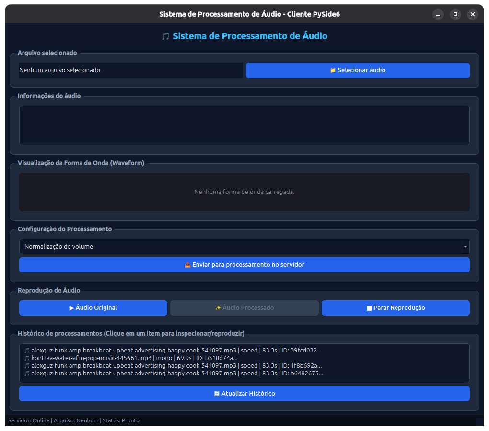
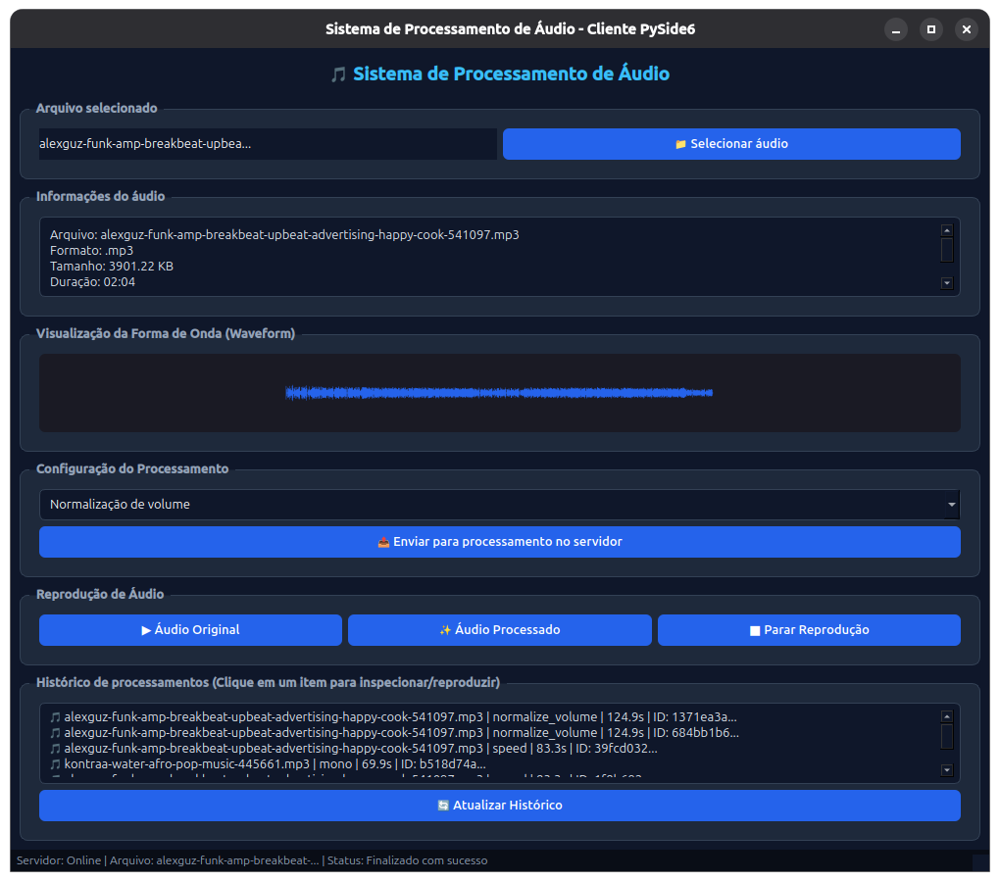

# Sistemas Distribuídos - Trabalho 03
## Sistema Cliente/Servidor em Camadas para Processamento de Áudio

---

## Descrição do Projeto

Sistema distribuído completo em 3 camadas (Cliente Desktop GUI, Servidor de Aplicação REST e Banco de Dados Relacional) para envio, processamento com FFmpeg, armazenamento estruturado em disco e gestão de metadados de áudio.

O cliente PySide6 permite selecionar arquivos de áudio localmente, visualizar a forma de onda (waveform), escolher o tipo de processamento e reproduzir o áudio original e processado. O servidor FastAPI recebe o arquivo, processa com FFmpeg, armazena tudo em disco organizado por data/UUID e persiste metadados no banco PostgreSQL.

---

## Arquitetura Utilizada

```text
┌─────────────────────────────────────────────────────────┐
│              CAMADA 1: CLIENTE (PySide6)                │
│  - Interface Gráfica Desktop (Qt / PySide6)             │
│  - Seleção de arquivos e leitura local de metadados     │
│  - Configuração de operações e parâmetros de áudio      │
│  - Player de áudio embutido (Original e Processado)     │
│  - Visualizador de forma de onda (waveform.png)         │
│  - Histórico interativo sincronizado via API            │
└───────────────────────────┬─────────────────────────────┘
                            │
                      HTTP / REST API
                            │
┌───────────────────────────▼─────────────────────────────┐
│              CAMADA 2: SERVIDOR (FastAPI)               │
│  - API REST assíncrona (Recebimento, Streaming, Busca)  │
│  - Motor de processamento FFmpeg                        │
│    (Normalização, Mono, Velocidade, Bitrate, Formato)   │
│  - Gerador automático de formas de onda (waveform.png)  │
│  - Armazenamento em disco por Data e UUID               │
│    storage/{YYYY}/{MM}/{DD}/{UUID}/                     │
│  - Geração de meta.json com Checksums SHA-256           │
│  - Gestão de exclusão com pasta storage/trash/          │
└───────────────────────────┬─────────────────────────────┘
                            │
                       SQLAlchemy
                            │
┌───────────────────────────▼─────────────────────────────┐
│             CAMADA 3: BANCO DE DADOS (PostgreSQL)       │
│  - Tabela 'audios' com metadados técnicos dos arquivos  │
│  - Duração, bitrate, taxa de amostragem, canais, paths  │
└─────────────────────────────────────────────────────────┘
```

---

## Instruções de Instalação

### Pré-requisitos
- Python 3.10+
- Docker e Docker Compose
- FFmpeg

### Passos

1. Clone o repositório:
   ```bash
   git clone <repo-url>
   cd SistemasDistribuidos_T3
   ```

2. Crie e ative o ambiente virtual:
   ```bash
   python3 -m venv .venv
   source .venv/bin/activate
   ```

3. Instale as dependências:
   ```bash
   pip install -r server/requirements.txt
   pip install -r client/requirements.txt
   ```

4. Instale o FFmpeg:
   ```bash
   sudo apt-get install ffmpeg   # Debian/Ubuntu
   # brew install ffmpeg         # macOS
   ```

5. Inicie o banco de dados:
   ```bash
   docker compose up -d
   ```

---

## Instruções de Execução do Servidor

Com o banco de dados já rodando (passo 5 da instalação), execute:

```bash
python server/run_server.py
```

O servidor ficará disponível em:
- **API:** `http://localhost:8000`
- **Swagger (docs):** `http://localhost:8000/docs`
- **Interface Web:** `http://localhost:8000/files`

---

## Instruções de Execução do Cliente

Com o servidor rodando, abra outro terminal (com o ambiente virtual ativado):

```bash
python client/main.py
```

> **Servidor em outra máquina?** Configure o IP antes de iniciar:
> ```bash
> export SERVER_HOST="192.168.X.Y"
> export SERVER_PORT=8000
> python client/main.py
> ```

---

## Configuração do Banco de Dados

O servidor usa um banco PostgreSQL provisionado via Docker Compose. As variáveis de conexão ficam no arquivo `.env` (copie de `.env.example`):

```env
POSTGRES_USER=postgres
POSTGRES_PASSWORD=postgres
POSTGRES_DB=audiodb
POSTGRES_HOST=localhost
POSTGRES_PORT=5434
```

Para iniciar o container:
```bash
docker compose up -d
```

O container `audio_postgres` expõe a porta **5434** localmente (mapeada para `5432` internamente).

---

## Exemplos de Processamento Disponíveis

| Tipo | Descrição |
|------|-----------|
| **Normalização de volume** | Equaliza o nível do áudio para um volume padrão |
| **Converter para mono** | Reduz de estéreo para um único canal de áudio |
| **Alterar velocidade** | Acelera ou desacelera a taxa de reprodução |
| **Reduzir bitrate** | Diminui a taxa de bits para economizar espaço |
| **Conversão de formato** | Muda a extensão do arquivo (ex.: mp3 → wav) |

---

## Prints da Interface

**Cliente sem arquivo selecionado:**



**Cliente com áudio carregado e waveform:**



---

## Organização dos Arquivos

Cada áudio processado é armazenado em subpastas estruturadas por ano, mês, dia e UUID único:

```text
server/storage/
├── 2026/
│   └── 09/
│       └── 16/
│           └── 8f3c7e8e-4a0b-4d7a-8f1b-3ef5a95f2d01/
│               ├── audio_original.mp3    # Áudio original enviado
│               ├── audio_processed.mp3   # Áudio resultante do processamento
│               ├── meta.json             # Checksums SHA-256 e parâmetros
│               └── waveform.png          # Visualização gráfica da forma de onda
└── trash/                                # Lixeira para arquivos excluídos
```

